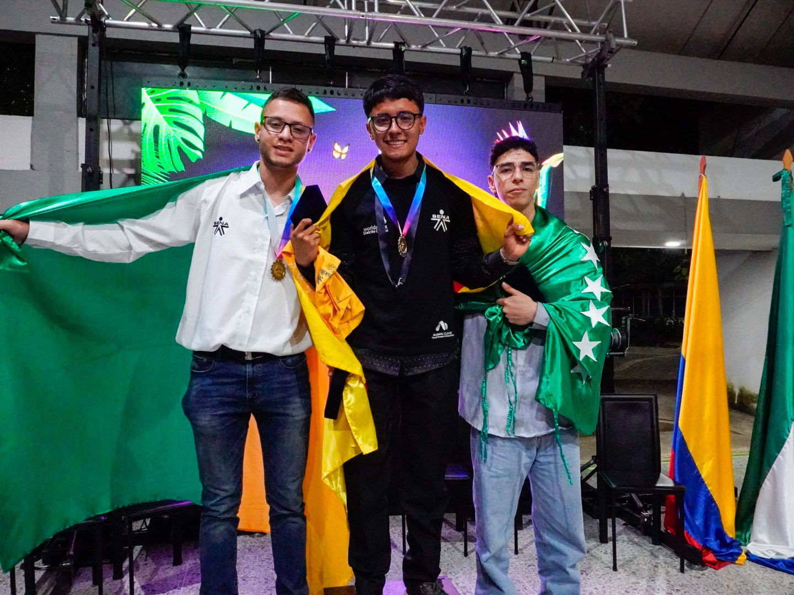
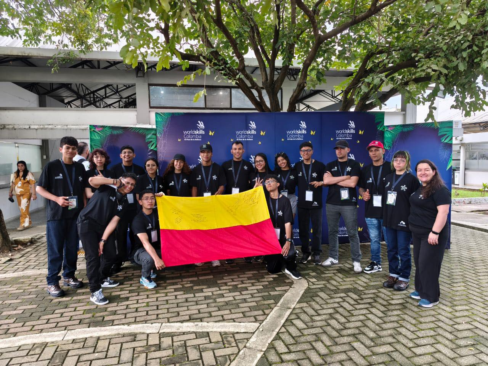
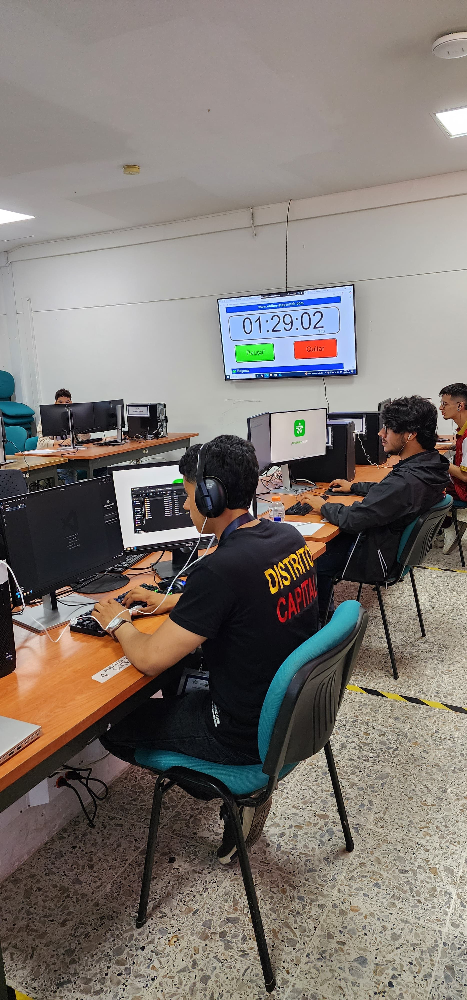
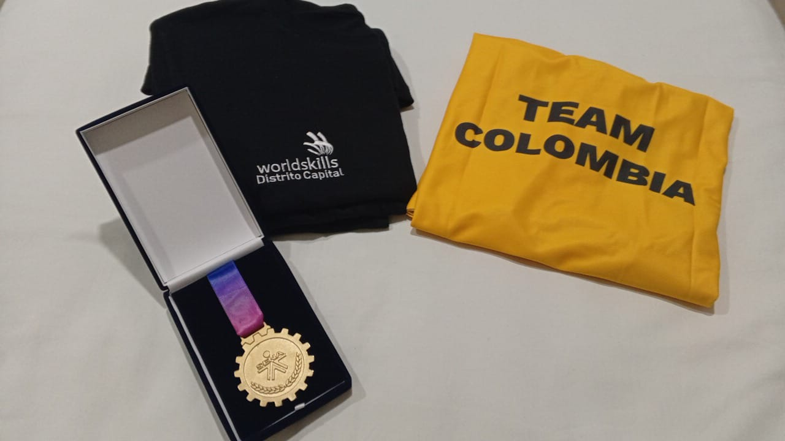

# 🏆 WorldSkills Colombia 2025 – 🥇 Oro Nacional en Tecnologías Web

[🥈 Ver anterior competencia (Preselección)](https://github.com/AndresGutierrezHurtado/worldskills-preseleccion-2025)

Este repositorio reúne todo el trabajo que desarrollé durante mi participación en la **competencia nacional WorldSkills Colombia 2025**, en la habilidad **17 - Tecnologías Web**, donde obtuve el **primer lugar a nivel nacional** 🥇.

Durante tres días de competencia, representé a la regional **Distrito Capital** enfrentando pruebas de alto nivel técnico que pusieron a prueba mi conocimiento, capacidad de adaptación y manejo del tiempo bajo presión.

En esta fase participamos los **seis mejores competidores del país**, cada uno representando una regional diferente. Lo que hizo de esta experiencia una de las más exigentes y enriquecedoras hasta ahora.

Aquí encontrarás todas las **tareas entregadas**, los **recursos utilizados** y los **proyectos desarrollados**, con un enfoque técnico sólido y soluciones prácticas que me permitieron destacar y obtener el primer lugar.

---

## 🏅 Highlights de la Competencia

_Delegación del Distrito Capital 2025_

_Durante la ejecución de las pruebas técnicas en la competencia nacional_

_Medalla y camiseta obtenidas por alcanzar el primer lugar nacional._

_Entrevista con Cristian Henao, creador de contenido sobre programación, durante la competencia nacional_

---

## 🏆 ¿Qué son las WorldSkills?

Las **WorldSkills** son una competencia internacional en la que aprendices de todo el mundo demuestran sus habilidades en diversas áreas técnicas y tecnológicas, como **programación, diseño, robótica, cocina**, entre muchas otras.  

Son, en esencia, las **olimpiadas de las habilidades técnicas**, donde no solo se evalúan conocimientos, sino también la capacidad de trabajar bajo presión y en condiciones que simulan un entorno laboral real.  

El objetivo principal de las WorldSkills es **destacar el nivel de formación, talento y excelencia** de los estudiantes y profesionales, además de **impulsar la educación práctica** y la mejora continua en los estándares de calidad del trabajo técnico.

---

## 🎯 Módulos de Competencia

Para el desarrollo de la prueba solo se permitió **Visual Studio Code como IDE**, sin extensiones, y con **una única oportunidad de uso de internet por módulo** (máximo de 5 minutos).

---

## 📬 Contacto

Para preguntas, soporte o colaboración, por favor contacta:

-   Andrés Gutiérrez Hurtado
-   Correo: [andres52885241@gmail.com](mailto:andres52885241@gmail.com)
-   LinkedIn: [Andrés Gutiérrez](https://www.linkedin.com/in/andr%C3%A9s-guti%C3%A9rrez-hurtado-25946728b/)
-   GitHub: [@AndresGutierrezHurtado](https://github.com/AndresGutierrezHurtado)
-   Portafolio: [Link portafolio](https://andres-portfolio-b4dv.onrender.com)
